# Evergreen — Customer Journey

**Tagline:** Identify. Care. Diagnose. Connect.
**Document type:** Customer Journey
**Version:** 1.0
**Date:** 2026-06-15

> 🗺️ See the [**visual journey map**](./customer-journey-diagram.html) for the full screen-by-screen flow across all 12 phases.

---

## Overview

Evergreen is a mobile plant care app for iOS and Android (Expo / React Native) that closes the full loop from first encounter with a plant to long-term care, community, and growth. It targets indoor and outdoor hobby gardeners at three skill levels — anxious beginners, collection-building enthusiasts, and accuracy-demanding experts — giving each a personalised daily care routine powered by AI identification, Dr. Plant diagnostics, and a social community. This document maps the end-to-end experience from discovery through long-term retention, phase by phase, so that every design and engineering decision can be traced back to a real user moment.

---

## Personas

| Name              | Archetype            | One-line goal                                                                                                      |
| ----------------- | -------------------- | ------------------------------------------------------------------------------------------------------------------ |
| **Maya, 27**      | Anxious Beginner     | Never kill another plant because she didn't know when or how to water it.                                          |
| **Devon, 34**     | Collector Enthusiast | Replace the spreadsheet-plus-Instagram combo with a single app that organises 25+ plants and lets him show off.    |
| **Dr. Priya, 48** | Expert / Botanist    | Trust the identification and diagnostics enough to recommend the app to students and become a community authority. |

---

## Phase 0 — Discovery & Download

**User goal:** I want to find an app that helps me keep my plants alive, not just identify them.

You hear about Evergreen through a friend's Instagram reel, a Reddit thread on r/houseplants, or an App Store feature. You open the store listing and see the screenshots: a clean green-tinted UI, a camera-scanning moment, a daily checklist. The tagline — "Identify. Care. Diagnose. Connect." — signals that this is more than a one-trick identifier. You read two or three reviews that mention the streak mechanic and the community swap board, and you tap **Get**. The install is roughly 30 MB; within seconds the app lands on your home screen and you open it for the first time.

**Screens involved:**
_(App Store listing — no in-app screen; Splash is the first Evergreen screen you see.)_

**Key interactions:**

- Read App Store screenshots and description
- Check ratings and recent reviews
- Tap **Get** / download
- Open the installed app

**System actions behind the scenes:**

- Nothing in Convex or Clerk yet — you are a pre-user.
- RevenueCat attribution can record the install source via an ASA or partner link.

**Pain points & design mitigations:**

- _Cold-start community concern:_ screenshots must show real-looking feed content, not empty states. Seeded ambassador posts prevent an empty community preview.
- _"Another plant ID app"_ fatigue: the care checklist and social screenshots must appear in the first three slides to differentiate.

**Transition to next phase:** The Splash screen animates open and the app detects you have no session.

---

## Phase 1 — First Launch & Authentication

**User goal:** I want to get into the app quickly, without inventing yet another password.

<table><tr>
  <td align="center">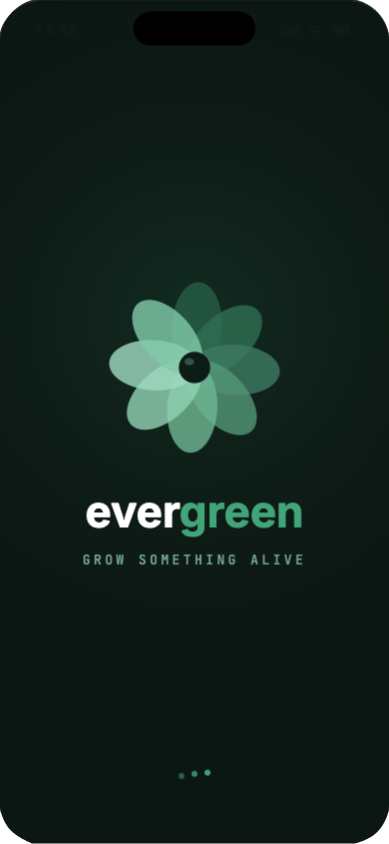 Splash</td>
</tr></table>

The Splash screen blooms the Evergreen logo on a dark canvas (`--ever-900 #0c1f17`) — a single breath of brand before anything is asked of you. Because there is no existing session, the router sends you silently to Login.

<table><tr>
  <td align="center">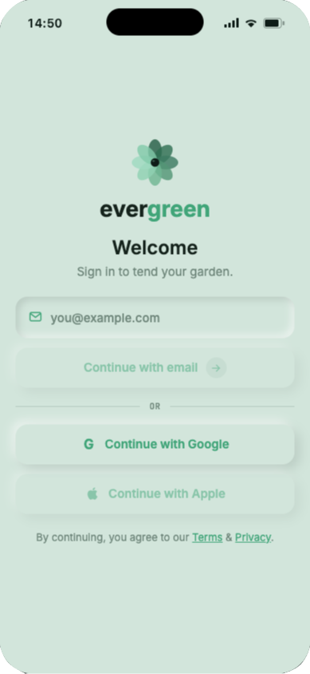 Login</td>
  <td align="center">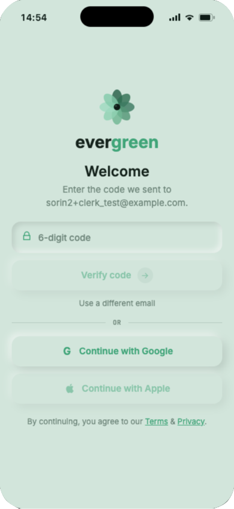 Email magic-link</td>
  <td align="center">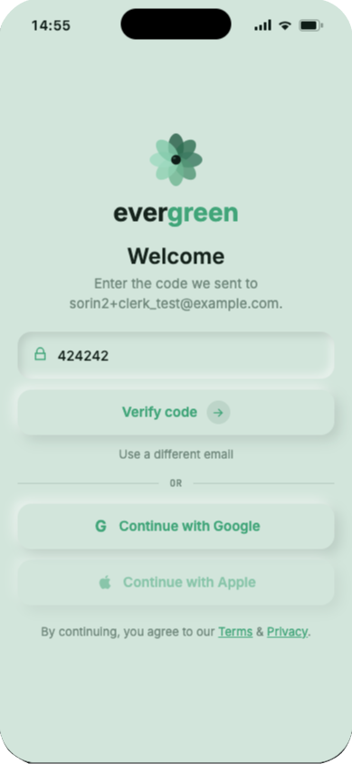 Check your inbox</td>
</tr></table>

The Login screen offers three paths: **Continue with Google**, **Continue with Apple**, and **Email magic link**. There is no password field. You tap Google, a native sheet appears, you select your account, and you are back in the app within seconds. Clerk provisions your identity, a `users` row is created in Convex, and — because you have no plants yet — you are routed into onboarding.

**Key interactions:**

- Choose Google / Apple / email magic-link
- Grant OAuth consent (native system sheet)
- (Email path) open magic-link from inbox and return to app

**System actions behind the scenes:**

- Clerk handles the OAuth handshake and issues a session JWT.
- A Convex `users.create` mutation provisions your row with `entitlement: "free"` and `plantsCount: 0`.
- RevenueCat `identify()` is called with the Clerk user ID to tie any future purchases to this identity.

**Pain points & design mitigations:**

- _Magic-link delay:_ a "Check your inbox — link expires in 10 minutes" confirmation is shown immediately; tapping the deep-link re-enters the app without a second tap.
- _Interrupted OAuth:_ if the native sheet is dismissed, the Login screen is simply restored — no error, no dead end.

**Transition to next phase:** Clerk session is confirmed; you are routed to the first onboarding step.

---

## Phase 2 — Location Onboarding (6 steps)

**User goal:** I want to tell the app where I keep my plants so it gives me advice that actually fits my situation.

Onboarding sets up your first **Location** — the top level of Evergreen's `Location → Place → Space → Plant` hierarchy. It is six focused steps, each on its own screen, with a progress indicator and a **Back** affordance. No step is mandatory; skipping degrades personalisation gracefully rather than blocking you.

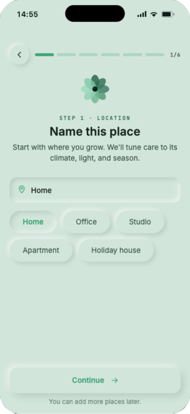

**Step 1 — Name your Location.** You type or choose a preset ("Home", "Holiday house", "Grandma's"). This becomes the label in the Garden header switcher later.

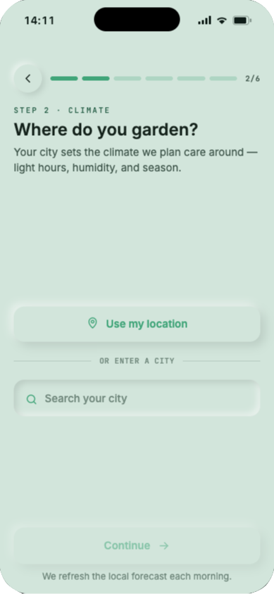

**Step 2 — Climate.** A city-search field appears with a pre-permission explainer: "Evergreen uses your approximate city to give weather-aware care reminders. We never store precise GPS." Tapping **Use my location** triggers the iOS/Android location prompt; denying it returns you to manual city entry. A live climate preview ("15 °C · Humid") confirms the match. The city is stored coarse (city-level) for Open-Meteo queries.

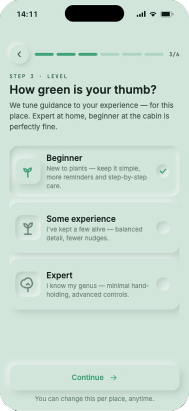

**Step 3 — Level.** Three cards: _Beginner · Some experience · Expert_. This is stored **per Location**, not per account. You can be an expert at home but a beginner at your holiday house — the distinction directly shapes the complexity of CarePlan tasks and the vocabulary used in care tips.

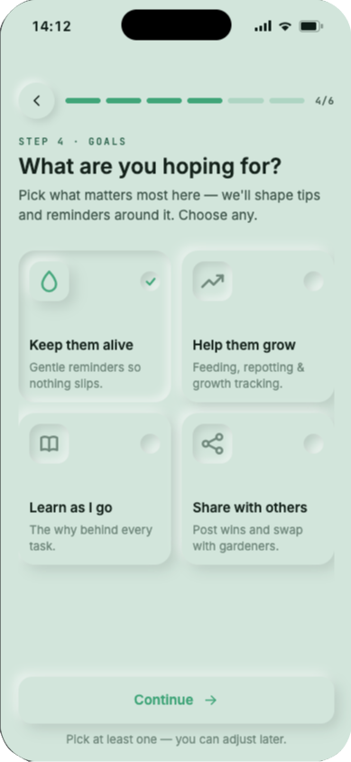

**Step 4 — Goals.** Multi-select chips: _Keep them alive · Grow my collection · Learn about plants · Share with others_. Also per-Location. A home Collector and a single-plant beginner get structurally different CarePlans from the same species even if their climate is identical.

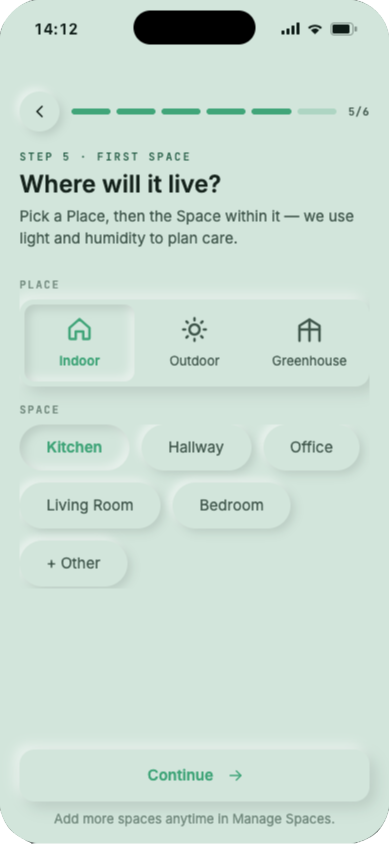

**Step 5 — First Place + Space.** You pick a **Place** (Indoor / Outdoor / Greenhouse) and then a **Space** within it — a room or area. Predefined Spaces (Living Room, Bedroom, Balcony) are pre-mapped to their likely Place; a custom "Other" entry asks you to confirm the Place. This one configuration step means your first plant has a real home the moment it is added.

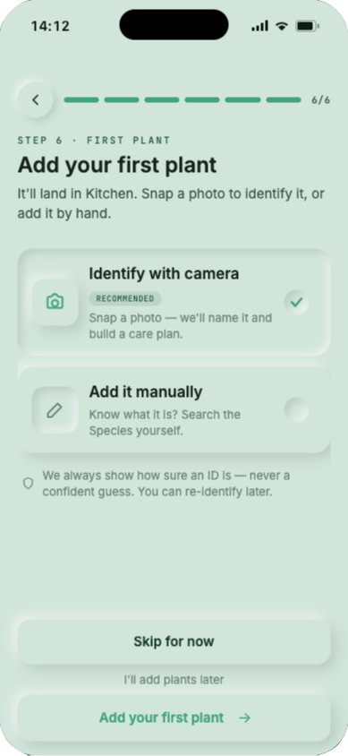

**Step 6 — First plant chooser.** A chooser sheet offers **Identify** (camera), **Add manually** (search or type a name), or a **Skip** link. Most new users choose Identify; skipping lands them on the Welcome screen with zero plants and a nudge to add their first later.

**Key interactions:**

- Type / search a Location name
- Grant or deny location permission; fall back to city search
- Select Level card (single-select)
- Toggle Goals chips (multi-select)
- Pick Place → pick or create a Space
- Tap Identify / Add manually / Skip

**System actions behind the scenes:**

- Each completed step writes to a draft Location document in Convex; it is committed on completion of Step 5.
- Level and Goals are stored as attributes of the Location entity, not the User entity.
- Open-Meteo is queried with the city to pre-fetch the climate profile used for CarePlan generation.
- Clerk session is referenced throughout; no re-authentication is needed.

**Pain points & design mitigations:**

- _Permission anxiety:_ the pre-permission explainer before the location prompt reduces denial rates; a denied permission never blocks progress.
- _Onboarding abandonment after Step 3:_ progress dots are visible throughout; each step is short and single-purpose.
- _"Why do you need my level twice?"_: a one-line sub-copy on the Level screen explains "Expert at home, beginner at the cabin" — the per-Location concept is surfaced in plain language.

**Transition to next phase:** The first plant chooser is shown; you tap **Identify** and the camera opens.

---

## Phase 3 — Plant Identification & Add to Garden

**User goal:** I want to point my camera at a plant and know immediately what it is and how to care for it.

<table><tr>
  <td align="center">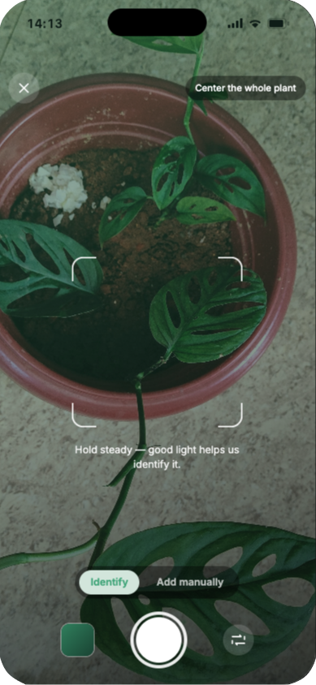 Capture &amp; identify</td>
  <td align="center">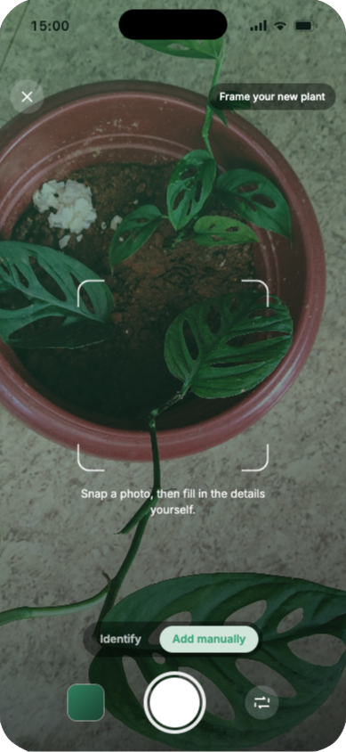 Capture · add manually</td>
</tr></table>

You tap **Identify** and the camera view opens with a live viewfinder and a shutter button. You frame the plant and shoot. The photo is uploaded to the Convex action layer, which calls the Plant.id API. While the model runs — typically 1–3 seconds — a subtle loading animation plays; the photo is not discarded.

The result is **confidence-gated**:

- **High confidence (single clear match):** The top species is shown with its common name, scientific name, a confidence percentage, and two or three bullet care facts. A large **Add to my garden** button is the obvious next action.
- **Low confidence (multiple candidates):** Instead of picking for you, Evergreen shows a ranked candidate list — typically 2–4 species — each with a thumbnail, name, and confidence score. Three escape hatches appear at the bottom: **Retake**, **Search manually**, **Add without identifying**. This is a deliberate trust-building moment: Evergreen admits uncertainty rather than confidently naming the wrong plant.

<table><tr>
  <td align="center">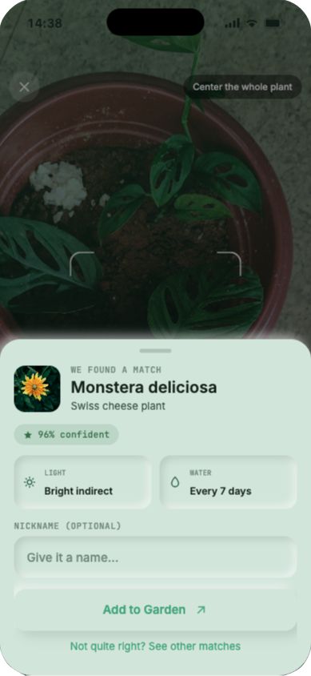 Identify result · Add to garden</td>
  <td align="center">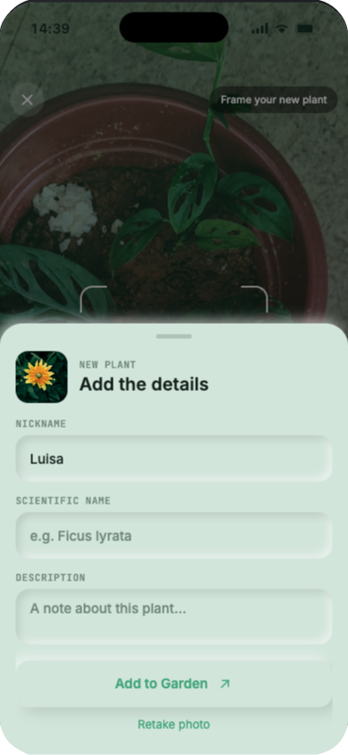 Add manually · Setup sheet</td>
</tr></table>

Once you select or confirm a species, a **Setup sheet** slides up: **Nickname** (optional — defaults to the common name), **Place** (pre-filled from Step 5), **Space** (pre-filled). You tap **Add plant** and Convex creates the Plant entity, links it to the Identification, and triggers CarePlan generation — an AI-reasoning step (Claude) that assembles a watering schedule, light check, and fertilising cadence calibrated to your Location's Level, Goals, and climate.

You land directly on the new **Plant detail** screen, Care tab open, your first set of CareTasks already populated.

**Key interactions:**

- Frame and shoot a photo (or import from gallery)
- Review high-confidence single result or low-confidence candidate list
- Tap **Retake**, **Search manually**, or **Add without identifying** if needed
- Edit nickname, Place, Space in the Setup sheet
- Tap **Add plant**

**System actions behind the scenes:**

- Photo uploaded to Convex file storage; a Convex action calls Plant.id.
- Identification entity created with the raw API response, confidence scores, and the selected species.
- CarePlan generated: a Claude reasoning call reads the Species care profile + Location attributes → outputs a structured task schedule stored as CareTask documents.
- `users.plantsCount` incremented; free-tier cap checked.

**Pain points & design mitigations:**

- _Wrong identification:_ the low-confidence candidate list and "Add without identifying" remove the pressure to commit to a bad guess.
- _AI outage (ADR-0002):_ the photo is preserved in Convex file storage; the user sees "Identification queued — we'll notify you when ready" rather than a hard error.
- _Setup sheet friction:_ Place and Space are pre-filled from onboarding, reducing the number of required taps to one (Add plant).

**Transition to next phase:** The Welcome screen appears for the first time.

---

## Phase 4 — Welcome & First Impression of the App Loop

**User goal:** I want to understand what Evergreen does for me every day, not just on day one.

The Welcome screen is shown exactly once, immediately after the first plant is added (or after onboarding is completed with a skip). It is a calm, celebratory moment — your plant's cover photo sits at the top, and a few lines of copy orient you to the daily loop: Today for your tasks, Garden for your collection, the camera FAB for new plants and diagnoses.

No tour overlay, no tooltip chain. The Welcome screen is a single tap to continue. From this point forward, every launch skips straight to the care-state router:

- **Plants > 0 + an Overdue or Due-today CareTask exists** → Today tab
- **Plants > 0 + no urgent tasks** → Garden tab
- **Plants = 0** → onboarding-first-plant screen

**Key interactions:**

- Read the welcome copy
- Tap **Let's go** (or equivalent CTA)

**System actions behind the scenes:**

- A `welcomeSeen: true` flag is written to the Convex user document; the Welcome screen is never shown again.
- The care-state router queries `careTasks` filtered by `dueDate ≤ today` across all Locations.

**Pain points & design mitigations:**

- _Overwhelm:_ the Welcome screen is deliberately brief. No feature checklist, no permission requests at this moment.
- _"Where are my tasks?"_: the care-state router means that if you already have overdue tasks (edge case on onboarding day), you land directly where action is needed.

**Transition to next phase:** You are routed to either Today or Garden.

---

## Phase 5 — Daily Care Ritual (Today Tab)

**User goal:** I want to know exactly which plants need attention today and mark them done in under a minute.

<table><tr>
  <td align="center">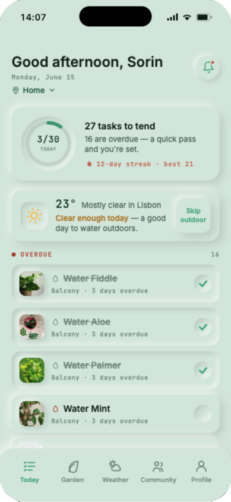 Today · urgency-grouped tasks</td>
  <td align="center">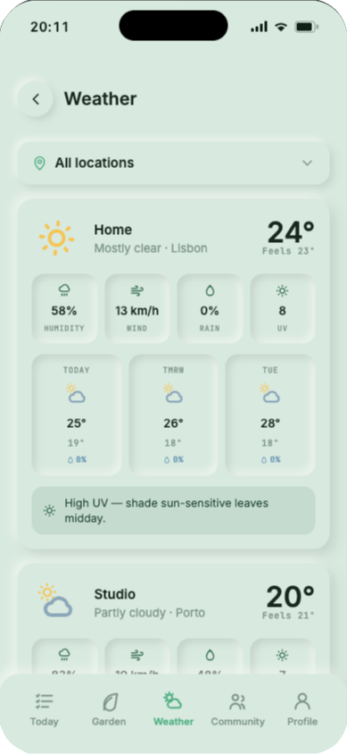 Weather-aware advisory</td>
</tr></table>

The Today tab is your daily home. CareTasks are grouped by urgency into three sections: **Overdue** (shown in a warm red accent), **Due today**, and **Coming up** (the next 7 days, collapsed by default). Each task row shows the plant's photo thumbnail, its nickname, and the task type (Water · Fertilise · Repot · Check · etc.). Your current streak is visible in the header — a terracotta flame and a number.

Tapping a task opens a **Task detail modal** that shows the full care note, a weather advisory if relevant ("Rain forecast today — skip outdoor watering?"), and three actions: **Done**, **Snooze** (push to tomorrow), **Skip** (mark intentionally skipped, no streak penalty). Swipe-to-done is available directly from the list for speed.

Push notifications deep-link to this tab with the specific task pre-highlighted, so a morning reminder requires zero navigation to act on.

**Key interactions:**

- Scroll the urgency-grouped list
- Tap a task row to open the detail modal
- Tap **Done** / **Snooze** / **Skip**
- Swipe right on a row to mark done inline
- Tap the streak number for a history breakdown

**System actions behind the scenes:**

- Convex `careTasks` query subscribed reactively — completing a task on one device updates the list on another in real time.
- Weather advisory pulled from Open-Meteo using the Location's city; advisory shown only when the forecast is actionable (rain, frost, heat spike).
- Streak computed server-side from CareTask completions; MMKV queue prevents false breaks if a "done" tap is made offline.
- Push notifications sent via Expo Notifications; receipt pruning runs nightly.

**Pain points & design mitigations:**

- _Notification fatigue:_ the default notification cadence is one daily digest, not per-task; users can adjust in Settings → Permissions.
- _Streak anxiety:_ the **Skip** action exists precisely so that a deliberate decision (holiday, sick plant) does not punish the streak.
- _Long list paralysis:_ the Coming-up section is collapsed by default; only Overdue and Today are open on load.

**Transition to next phase:** Tasks done, you navigate to the Garden tab to browse your collection.

---

## Phase 6 — Garden Exploration

**User goal:** I want to see all my plants at a glance, filter by where they live, and jump to any plant in one tap.

<table><tr>
  <td align="center">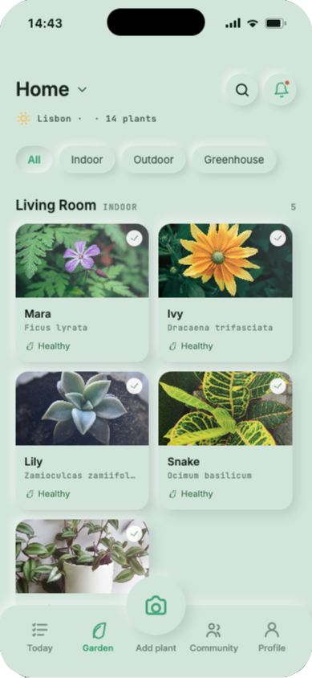 Garden · grouped by Space</td>
</tr></table>

The Garden tab shows the contents of the active **Location**. The header displays the Location name ("Home") as a tappable switcher ("Home ▾") — free users see a static label; Evergreen+ users with multiple Locations see a dropdown listing each and a **+ Add location** option (gated on plan).

Below the header, **Place filter chips** — All · Indoor · Outdoor · Greenhouse — let you narrow the view. Plants are grouped under their **Space** (e.g. "Living Room (Indoor)", "Balcony (Outdoor)"), each group labelled with the Space name and Place. Every plant is represented by a card: cover photo, nickname, and a coloured dot for the next due task status. One tap on a card opens Plant detail.

The center **FAB** (camera icon) opens the capture chooser. A **Manage Spaces** link at the bottom of the list opens a modal to create, rename, or reassign Spaces and move plants between them.

**Key interactions:**

- Tap **Home ▾** to switch Location or add a new one
- Tap a **Place chip** to filter
- Tap a **plant card** to open Plant detail
- Tap the **FAB** to identify or add a plant
- Tap **Manage Spaces** to reorganise

**System actions behind the scenes:**

- Convex `plants` query filtered by `locationId` and optionally by `placeType`; subscribed reactively.
- Location switcher reads `locations` owned by the user; plan entitlement checked before showing **+ Add location**.
- Free-tier plant cap (5) is checked before the FAB add flow completes — not at the point of tapping the FAB.

**Pain points & design mitigations:**

- _Finding a specific plant in a large collection:_ the search icon in the header opens a full-text search across nicknames and species names within the active Location.
- _Confusion about Place vs Space:_ the Space label always includes the Place in parentheses so the hierarchy is always visible without explanation.

**Transition to next phase:** You tap a plant card and land on Plant detail.

---

## Phase 7 — Plant Detail & Ongoing Care

**User goal:** I want a complete, living record of this plant — its care schedule, health history, and photos — all in one place.

<table><tr>
  <td align="center">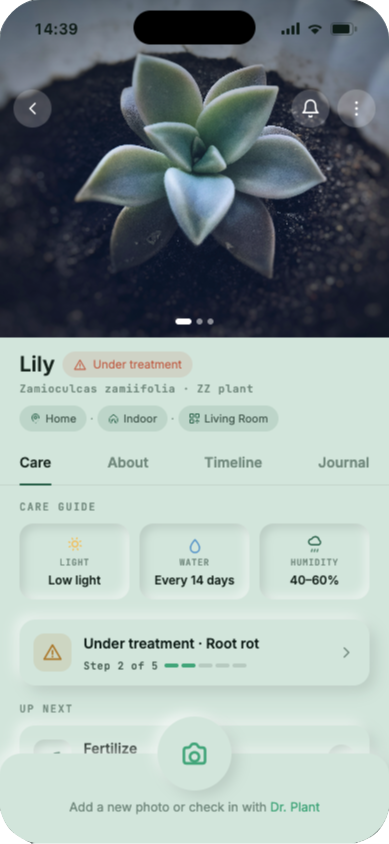 Care</td>
  <td align="center">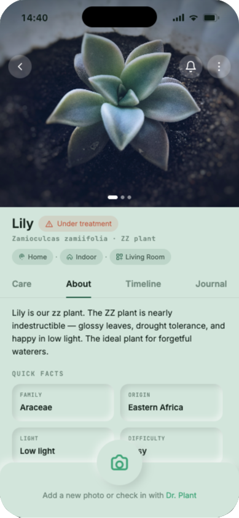 About</td>
  <td align="center">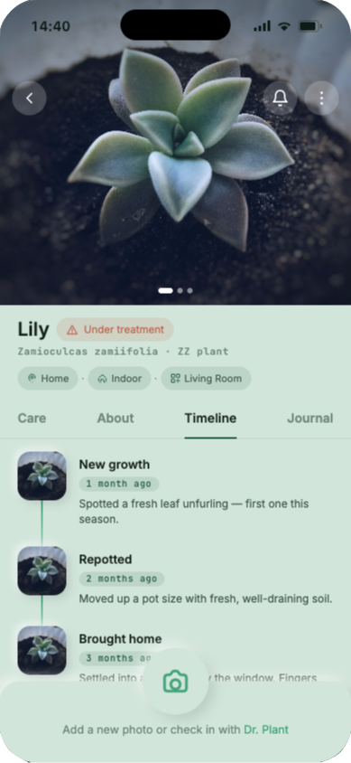 Timeline</td>
  <td align="center">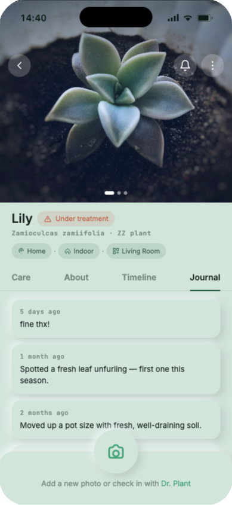 Journal</td>
</tr></table>
<table><tr>
  <td align="center">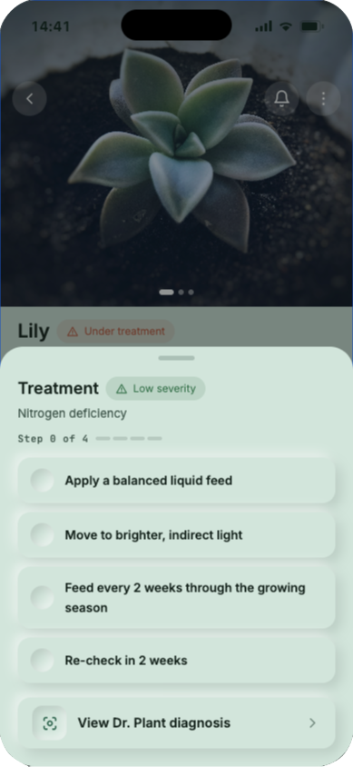 Active Treatment banner</td>
  <td align="center">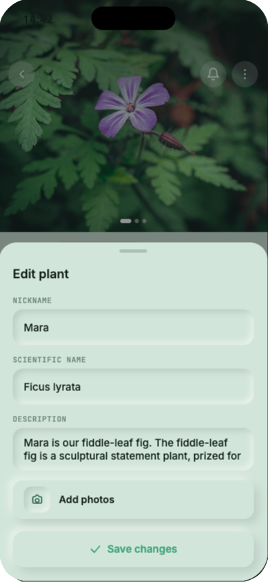 Edit nickname</td>
  <td align="center">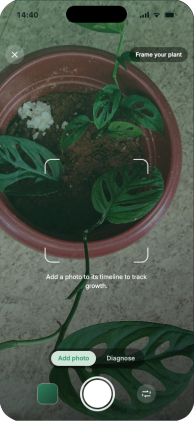 Add photo</td>
  <td align="center">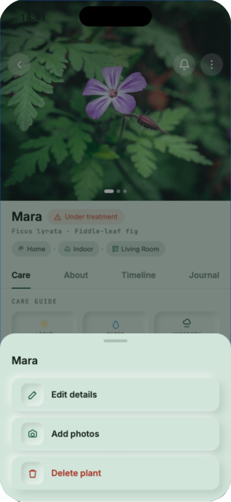 Edit · add photo · delete</td>
</tr></table>

Plant detail opens with a **photo-carousel hero** — all photos added to this plant, in reverse chronological order. Below it, a sticky tab bar offers four tabs: **Care · About · Timeline · Journal**.

- **Care** is the default. It shows the full CareTask list for this plant — the same tasks that appear in Today, but filtered to this single plant. Each row is tappable to mark done inline. If an active Treatment is running (from a Dr. Plant diagnosis), a coloured **Active Treatment** banner appears at the top of the Care tab describing the treatment protocol and its remaining duration.
- **About** shows the Species care profile: ideal light, watering frequency, soil type, toxicity, and a link to the Encyclopedia Species page.
- **Timeline** shows a chronological photo and event feed — photos added, tasks completed, identifications run, Treatments started and resolved.
- **Journal** is a free-text log. You can add dated notes ("repotted into a 15cm terracotta pot today").

The overflow menu ( ⋮ ) offers **Move to another Space**, **Edit nickname**, **Add photo**, and **Mark as gone** — the empathetic offboarding path that archives the plant into Memorial rather than deleting it.

**Key interactions:**

- Swipe through the photo carousel
- Switch between Care / About / Timeline / Journal tabs
- Tap a CareTask row to mark done
- Tap the ⋮ menu → **Move to another Space**
- Tap ⋮ → **Mark as gone** to begin offboarding

**System actions behind the scenes:**

- `plant` document subscribed reactively; any CareTask completion syncs to Today tab in real time.
- Timeline events are computed from `careTasks`, `identifications`, `photos`, and `treatments` linked to this plantId.
- "Mark as gone" sets `plant.status: "archived"`, frees the free-tier plant slot, and writes to `memorial`.

**Pain points & design mitigations:**

- _Sticky tab bar on short phones:_ the photo carousel hero collapses on scroll so the tab bar is always reachable.
- _Accidental archiving:_ "Mark as gone" triggers a confirmation sheet with an empathetic post-mortem prompt ("What happened? (optional)") before committing.

**Transition to next phase:** You tap the camera icon on Plant detail to diagnose a sick leaf.

---

## Phase 8 — Dr. Plant (Diagnosis)

**User goal:** I want to know what is wrong with my plant and what to do about it, right now.

From the Plant detail camera chooser, you select **Diagnose**. The camera opens in diagnosis mode; you photograph the affected leaf or stem.

The photo is uploaded and passed to Plant.id's health-assessment endpoint alongside the plant's Species context. Dr. Plant returns a diagnosis — a disease or pest identification, confidence score, and a treatment protocol. The result screen shows a plain-language summary: what the problem likely is, how confident the AI is, and what to do next (e.g. "Isolate from other plants. Apply neem oil every 5 days for 3 weeks.").

Tapping **Save diagnosis** creates a **Treatment** entity linked to this Plant. You are returned to Plant detail, where the Active Treatment banner now appears in the Care tab with a countdown and protocol reminder.

**Gate:** Dr. Plant is an Evergreen+ feature. Free users tapping **Diagnose** are routed to the Paywall with the framing "Diagnose sick plants — Evergreen+ only. Start your 7-day free trial."

<table><tr>
  <td align="center">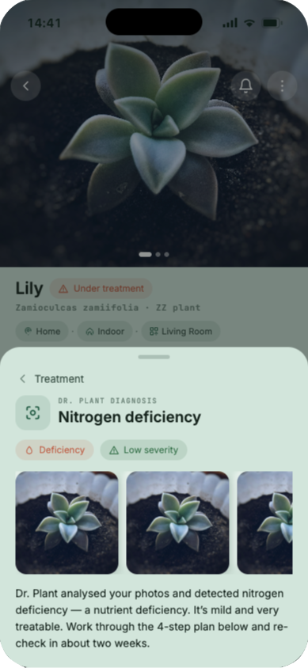 Care · Diagnose entry</td>
  <td align="center">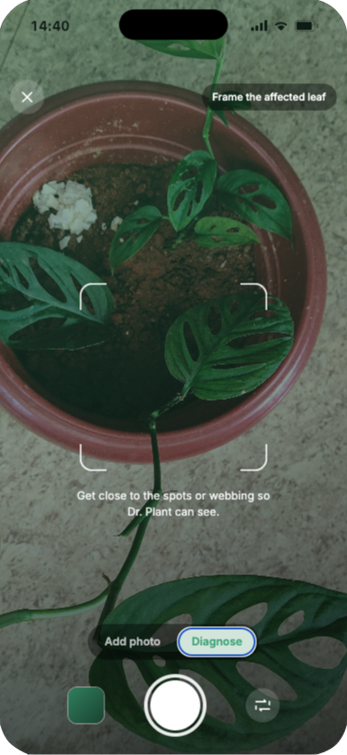 Diagnose · capture</td>
  <td align="center">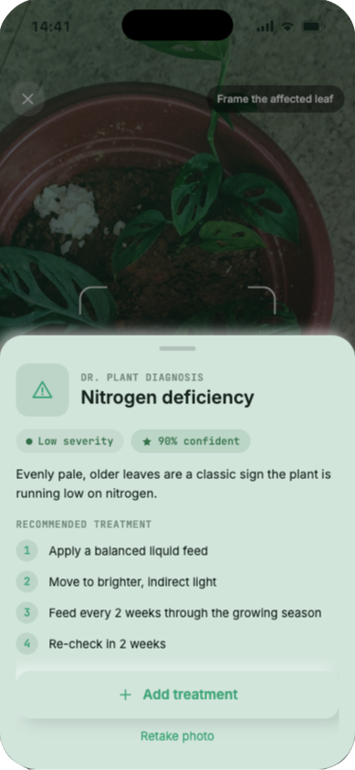 Dr. Plant result</td>
  <td align="center"> Active Treatment</td>
</tr></table>

**Key interactions:**

- Tap **Diagnose** in the Plant detail camera chooser
- Frame and shoot the affected area
- Review the Dr. Plant result
- Tap **Save diagnosis** to create a Treatment
- (Free users) tap through to the Paywall

**System actions behind the scenes:**

- Convex action calls Plant.id health endpoint with the photo + species context.
- `entitlement` checked server-side before the action runs; free users never spend an API call.
- Treatment document created: `plantId`, `diagnosisId`, `protocol`, `startDate`, `endDate` (computed from protocol duration).
- CareTask documents generated for each protocol step (e.g. "Apply neem oil" repeating every 5 days).

**Pain points & design mitigations:**

- _AI outage:_ diagnosis photo preserved; retry offered; user notified by push when result is ready.
- _Low-confidence diagnosis:_ result screen shows confidence explicitly; "Not sure? Get a second opinion from the community" link opens a pre-filled Community post.
- _Paywall friction:_ the paywall names the exact feature being gated and offers a 7-day trial with no credit card required on iOS (StoreKit).

**Transition to next phase:** Treatment saved; you open the Community tab to share the win (or ask for help).

---

## Phase 9 — Community & Social

**User goal:** I want to share my plants with other gardeners, swap cuttings, and learn from people who know more than I do.

<table><tr>
  <td align="center">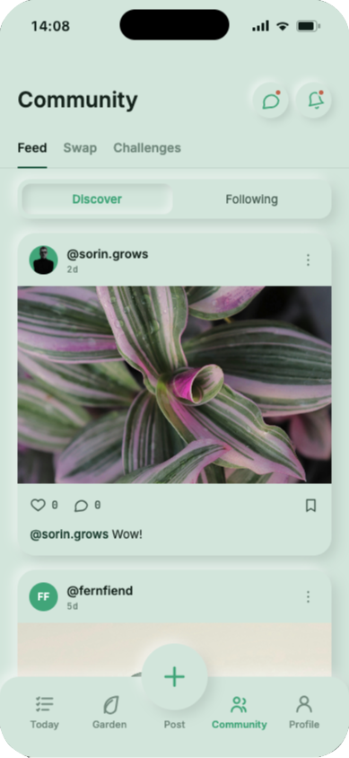 Feed · Discover</td>
  <td align="center">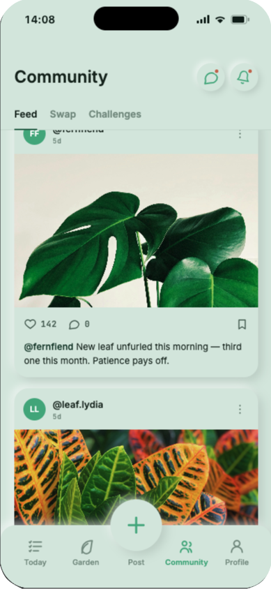 Feed · Following</td>
  <td align="center">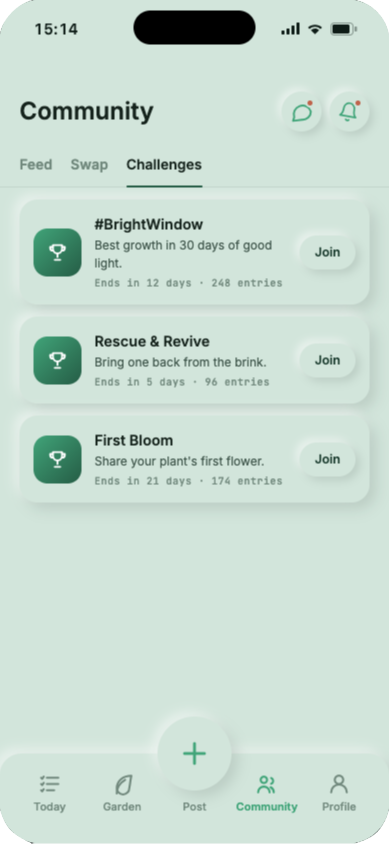 Challenges</td>
</tr></table>
<table><tr>
  <td align="center">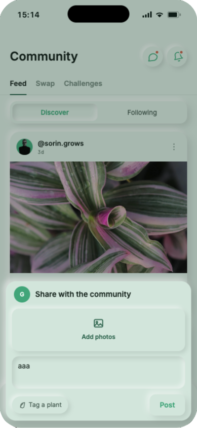 Create post</td>
  <td align="center">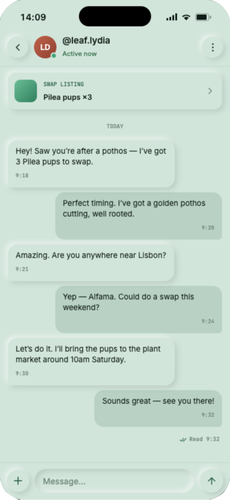 Direct messages</td>
</tr></table>

The Community tab has three top-tabs: **Feed** (with a Discover ⇄ Following toggle), **Swap**, and **Challenges**. The feed defaults to **Discover** until you follow enough accounts for Following to feel useful — solving the cold-start problem by surfacing seeded and trending content immediately.

Each post card shows the gardener's avatar, handle, photo(s), caption, and engagement counts. Tap a card to open post detail with comments. A ⋮ on any post or comment reveals **Report / Block / Mute**.

The center FAB opens **Create post**: pick photos from your library or take a new one, add a caption, optionally tag a Species or a Plant from your garden. Before publishing, a Convex action runs the image through the moderation API (Hive / AWS Rekognition): clearly-violating content is blocked pre-publish; borderline content publishes but is flagged to the moderation queue.

**First community write** triggers the **@handle claim** modal — a one-time step where you choose your public handle. After that, posts appear under your handle immediately.

**DMs** are accessible via the ✉ icon in the Community header — a separate inbox from the 🔔 bell. Swap listings and Challenges have their own detail flows.

**Key interactions:**

- Toggle Discover ⇄ Following
- Tap a post to open detail and comments
- Tap ⋮ → **Report / Block / Mute**
- Tap FAB → compose and publish a post
- Claim your @handle on first write
- Tap ✉ to open DMs

**System actions behind the scenes:**

- Convex `posts` query subscribed; new posts appear without a pull-to-refresh.
- Moderation action runs on every photo upload; borderline flags go to `moderation-queue` readable only by moderator/admin roles.
- Block is bidirectional: both users' feeds are updated atomically.
- DM messages delivered via Convex real-time subscriptions.

**Pain points & design mitigations:**

- _Cold-start empty feed:_ Discover defaults to seeded ambassador content; the Following tab is hidden until you follow at least one account.
- _Harassment:_ Report / Block / Mute are one tap from any surface; blocked accounts cannot see your profile or DM you.
- _Posting gated on Evergreen+:_ the paywall names this explicitly ("Share your garden with the community — Evergreen+ only") rather than silently disabling the FAB.

**Transition to next phase:** You tap the Profile tab to check your stats and manage your account.

---

## Phase 10 — Profile, Settings & Growth

**User goal:** I want to see how I am doing, manage my plants and Locations, and control my account.

<table><tr>
  <td align="center">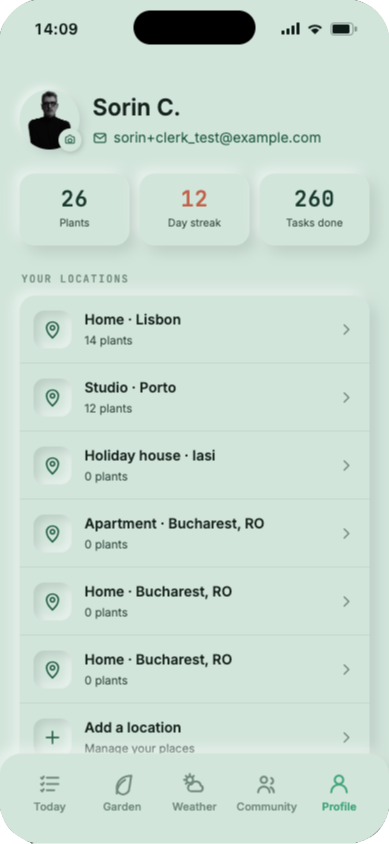 Profile · stats</td>
  <td align="center">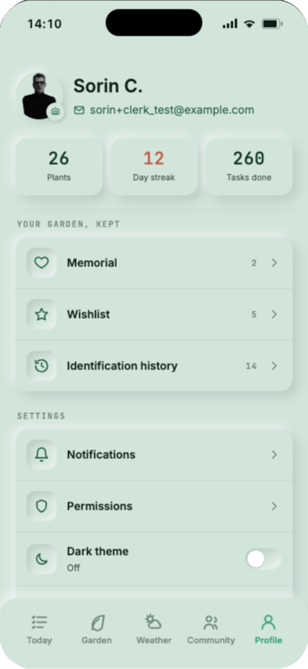 Profile · Locations</td>
  <td align="center">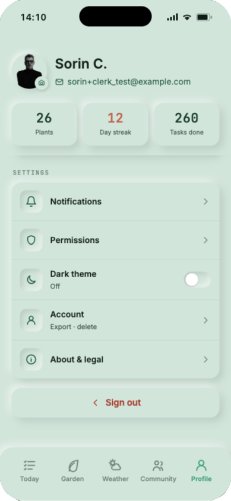 Profile · shortcuts</td>
</tr></table>
<table><tr>
  <td align="center">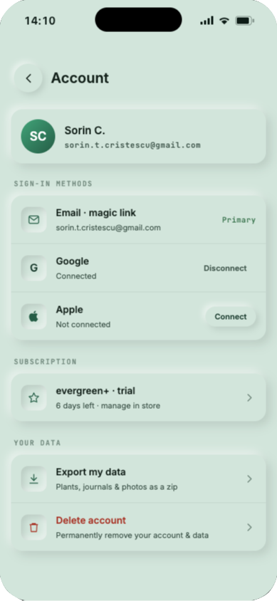 Settings · Account</td>
  <td align="center">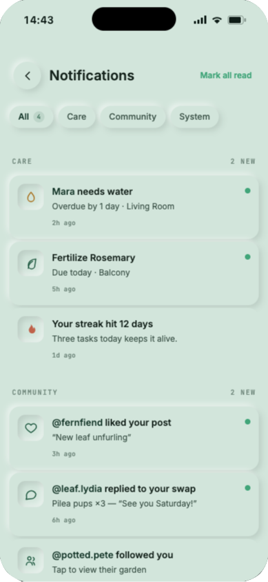 Settings · Notifications</td>
  <td align="center">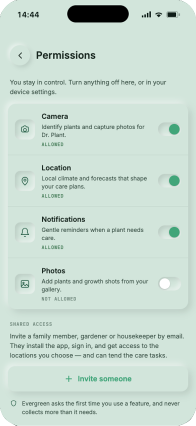 Settings · Permissions</td>
  <td align="center">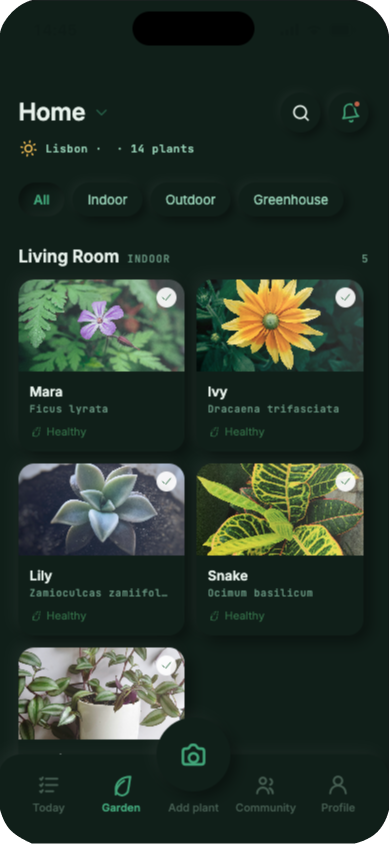 Settings · Dark theme</td>
</tr></table>

The Profile tab is your private hub. At the top, a **stats row** shows total plants, current streak, and tasks completed this month. Below it: your **Locations list** (rename, change Level/Goals, delete, + Add), your **Evergreen+ card** ("Upgrade" or "Manage subscription"), and shortcuts to **Memorial**, **Wishlist**, and **Identification history**.

The **Settings** sub-stack covers account identity and data export, notification preferences, camera/location/photos permissions (with the rationale for each), appearance (dark mode toggle), and the legal/abuse sub-stack (About · Terms · Privacy · Acknowledgements · Rate · Blocked accounts · Report).

<table><tr>
  <td align="center"> Memorial</td>
  <td align="center"> Identification history</td>
</tr></table>
<table><tr>
  <td align="center"> About &amp; legal</td>
  <td align="center"> Terms of Service</td>
  <td align="center"> Privacy Policy</td>
  <td align="center"> Blocked accounts</td>
  <td align="center"> Rate · Enjoying Evergreen</td>
</tr></table>

**Memorial** shows archived plants with their full care and photo history preserved. It is designed to be a warm, non-morbid record — plants are never deleted, just retired.

**Wishlist** is a list of Species you are planning to grow next, linkable to Encyclopedia pages.

**Identification history** shows every scan you have run, the confidence scores returned, and which candidate you selected — transparent AI provenance.

**Key interactions:**

- Tap a Location to rename or adjust Level/Goals
- Tap **+ Add** to start a new Location (gated)
- Tap the Evergreen+ card to open the Paywall
- Navigate to Memorial / Wishlist / Identification history
- Toggle dark mode
- Manage blocked accounts
- Export data or delete account

**System actions behind the scenes:**

- `locations` list subscribed reactively; plan entitlement checked before + Add is enabled.
- Data export generates a JSON archive of plants, photos, journal entries, and identifications via a Convex scheduled action; download link sent by push.
- Account deletion schedules a 30-day grace period before permanent removal; all community content is anonymised, not deleted.

**Pain points & design mitigations:**

- _Hard to find account deletion:_ "Delete account" is in Settings → Account, clearly labelled but one level deep — intentionally not hidden, but also not surfaced at the top level.
- _Losing data on downgrade:_ the downgrade behaviour (see Phase 11) is explained on the Evergreen+ card in plain terms before any subscription change is made.

**Transition to next phase:** You tap the Evergreen+ card and land on the Paywall.

---

## Phase 11 — Subscription & Monetisation

**User goal:** I want to understand exactly what I am paying for before I commit.

The Paywall is a shared modal raised contextually at each free-tier cap — never on first launch, never at an arbitrary moment. Each invocation names the specific limit that has been hit and what Evergreen+ unlocks:

| Trigger                       | Contextual framing                                                                |
| ----------------------------- | --------------------------------------------------------------------------------- |
| Add 2nd Location              | "1 location on free. Evergreen+ lets you add your cabin, office, or balcony."     |
| Add 6th Plant                 | "You have 5 plants on free. Evergreen+ lets your collection grow without limits." |
| 4th identification this month | "3 IDs/month on free. Evergreen+ gives you unlimited plant scanning."             |
| Tap Dr. Plant                 | "Diagnostics is Evergreen+ only. Identify diseases and build a Treatment plan."   |
| Post to Community             | "Posting is Evergreen+ only. Share your garden with the community."               |

The Paywall offers the monthly price ($7.99) and an annual price ($39.99 — highlighted as "Save 58%"), a **7-day free trial** prominently displayed, and a **Restore purchases** link. On iOS, no credit card is entered in the app — StoreKit handles it natively. On Android, Google Play Billing.

RevenueCat's `CustomerInfo` is checked optimistically on the client to unlock features instantly after purchase; the authoritative gate is the `users.entitlement` field in Convex, enforced server-side on every capped action.

**Downgrade scenario:** If an Evergreen+ subscriber with multiple Locations downgrades to free, extra Locations become **locked read-only** — visible with an "Upgrade to reactivate" banner, but no data is deleted. The user chooses which Location stays active. Plants, history, and journal entries are fully preserved; re-subscribing restores full access immediately.

**Key interactions:**

- Review the contextual framing (what limit was hit)
- Select monthly or annual plan
- Tap **Start free trial** (or **Subscribe**)
- Tap **Restore purchases** if previously subscribed
- Dismiss the Paywall to stay on the free tier

**System actions behind the scenes:**

- RevenueCat `purchasePackage()` called; StoreKit / Play Billing handles payment UI.
- RevenueCat webhook → Convex function updates `users.entitlement` to `"plus"`.
- On downgrade: Convex scheduled function runs nightly; sets extra Locations to `status: "locked"`.

**Pain points & design mitigations:**

- _"Surprised by a paywall"_: contextual framing and the transparent free-tier limits (shown in Profile) mean no user should be surprised by where the wall is.
- _Trial confusion:_ the 7-day trial is explained plainly — "No charge for 7 days. Cancel anytime in App Store / Play Store settings."
- _Downgrade data loss fear:_ the downgrade behaviour is documented on the Profile Evergreen+ card before the user cancels.

**Transition to next phase:** Subscription set; you return to your daily Evergreen routine.

---

## Phase 12 — Long-term Retention & Re-engagement

**User goal:** I want Evergreen to be the first thing I open when I think about my plants, every day.

On every subsequent launch after the first, the Splash animates and the care-state router fires silently — no login prompt, no onboarding, no Welcome screen. You land in Today if anything is overdue or due, or in Garden if you are caught up. The loop is immediate.

**Streak preservation** is the primary daily motivator. The MMKV offline queue means that marking a task done while on the Underground still counts — the streak never breaks because of a connectivity gap.

**Push deep-links** bring you back precisely: a morning reminder tap opens the specific CareTask modal, not just the Today tab. A community notification tap opens the specific post or DM thread.

**Seasonal challenges** (Challenges tab → Community) provide periodic re-engagement moments tied to the planting calendar — propagation season, winter dormancy, spring repotting — giving returning users a reason to open the app even when their care tasks are caught up.

**Memorial** serves as an emotional anchor: your lost plants are never deleted and their history never disappears. A user who returns after a break finds their past collection intact, with no data lost and no punishing "your account was cleaned up" message.

<table><tr>
  <td align="center"> Today · catch-up</td>
  <td align="center"> Garden · caught up</td>
</tr></table>

**Key interactions:**

- Receive and tap a push notification → land on the relevant task or thread
- Complete daily CareTask streak
- Join or submit to a Seasonal Challenge
- Visit Memorial to revisit past plants
- Add a new Location (Evergreen+) when the collection expands to a new home

**System actions behind the scenes:**

- Care-state router query runs on every Splash render; result is cached for < 200ms to avoid visible delay.
- Offline task completions queued in MMKV; flushed and streak re-computed on reconnect.
- Expo push receipts pruned nightly; dead tokens removed to prevent send-queue bloat.
- Seasonal challenge content seeded by the Evergreen team via a Convex admin action.

**Pain points & design mitigations:**

- _Re-engagement after a break:_ if a user returns after 14+ days with many overdue tasks, the Today tab shows a soft "Welcome back — let's catch up" header rather than an intimidating wall of red overdue rows; only the top 3 are shown expanded, with "Show all" to expand.
- _Churn at plan renewal:_ the annual plan reminder (via push, 3 days before renewal) links to Profile → Evergreen+ with a summary of the user's stats ("You cared for 12 plants this year") — a retention moment framed as celebration, not billing.

---

## Emotional Arc

| Phase                       | User emotion                                      |
| --------------------------- | ------------------------------------------------- |
| 0 — Discovery               | Curious / Hopeful ("this might actually work")    |
| 1 — Authentication          | Relieved (no password)                            |
| 2 — Onboarding              | Engaged / Slightly uncertain ("what is a Space?") |
| 3 — First Identification    | Delighted / Trusting (the AI knew it)             |
| 4 — Welcome                 | Oriented                                          |
| 5 — Daily Care (first week) | Motivated / Slightly anxious about the streak     |
| 6 — Garden exploration      | Proud (my collection, organised)                  |
| 7 — Plant detail            | Attached (this plant has a history now)           |
| 8 — Dr. Plant               | Relieved / Grateful (I know what's wrong)         |
| 9 — Community               | Social / Seen                                     |
| 10 — Profile                | Reflective / In control                           |
| 11 — Paywall                | Considered (I see the value) → Committed          |
| 12 — Long-term              | Habitual / Proud                                  |

---

## Monetisation Touchpoints

Evergreen's paywall strategy is **contextual, not interstitial**. The paywall is never shown on first launch, never shown after a cold open, and never shown on a timer. It appears exactly once per cap encounter, with framing that names the limit and the unlock in the same breath.

The five contextual gates are ordered by the natural growth of a user's engagement:

1. **2nd Location** — power users expanding to a second home encounter this first; it is the highest-intent gate.
2. **6th Plant** — collection builders hit this within weeks; the collection is already invested in.
3. **4th Identification** — curious users who scan everything encounter this mid-month; the AI magic moment is the conversion hook.
4. **Dr. Plant** — a sick plant creates urgency; the paywall lands at maximum motivation to pay.
5. **Community posting** — social users who want to share encounter this gate; the community content they have been consuming creates reciprocal pressure.

The 7-day trial requires no credit card on iOS (StoreKit), lowering the commitment threshold to nearly zero. The annual plan is highlighted with the savings percentage to anchor the monthly price as the less-value option.

---

## Edge Cases & States

**Offline / pending sync.** Photo uploads, journal entries, task completions, and Space moves are queued in MMKV when the device is offline. A visible **"pending sync"** chip appears on affected rows. Queued writes are flushed in order on reconnect. No streak breaks occur due to connectivity loss.

**AI vendor outage (ADR-0002).** If Plant.id or Claude is unavailable, the capture flow never hard-fails. The photo is stored in Convex file storage; the user sees a "Queued for identification — we'll notify you" message. Identification and CarePlan generation are independent; a CarePlan failure does not block the plant from being added.

**Low-confidence identification.** The candidate list is shown with explicit confidence scores. The user can retake, search manually, or add without identifying. A plant added without identification has no Species linked; CarePlan generation uses generic fallback care tasks and prompts the user to identify later.

**Downgrade from Evergreen+ to free.** Extra Locations are locked read-only with an "Upgrade to reactivate" banner. Location #1 (or the user's choice) remains active. All plant data, photos, journal entries, and identifications are preserved. Re-subscribing restores full access immediately with no data migration.

**Account deletion.** A 30-day grace period applies after the delete request. Community content is anonymised (handle replaced with "deleted_user"), not removed. Plant and journal data is permanently deleted after the grace period.

**Blocked / reported users.** Blocking is bidirectional and immediate. Reported content is queued for the moderation role; clearly-violating content is removed pre-queue by the AI moderation prefilter.

---

## Accessibility & Inclusion

**Touch targets.** All interactive elements meet the 44pt minimum on both iOS and Android. The Plant card tap area extends to the full card, not just the text. Task row swipe targets are full-width.

**Dynamic type.** All text elements use relative units (no fixed pixel sizes for body text). Layout reflows at accessibility text sizes — the photo carousel hero shrinks to preserve space for enlarged labels. Truncation is avoided in favour of reflow or scroll.

**Colour contrast.** The green palette (`--ever-500 #2c694e` on `--ever-100 #d8e9df`) is verified at WCAG AA (4.5:1 for normal text, 3:1 for large). Status indicators (Overdue, Done, Coming up) are never colour-only — each is paired with an icon and a text label.

**Reduced motion.** All entrance animations, the logo bloom on Splash, and the streak celebration animation respect the `prefers-reduced-motion` OS setting. Transitions fall back to cross-dissolve at 150ms.

**Screen reader support.** All interactive elements carry `accessibilityLabel` and `accessibilityRole` props. Photo carousels announce their position ("Photo 2 of 5"). The confidence score on identification results is announced as a percentage, not a bar graphic.

**Colour-blind safety.** The Overdue (warm red) and Done (green) states are differentiated by icon shape (⚠ vs ✓) in addition to colour, ensuring usability for deuteranopes.

**Language.** v1.0 is English-only with all strings externalised for future i18n. Right-to-left layout is not implemented in v1 but the component structure avoids hardcoded `flexDirection: 'row'` reversals that would block an RTL pass.
